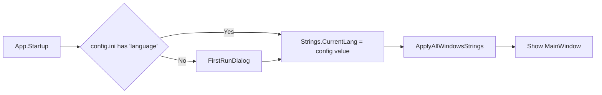

# I18N + User Guide Plan

## 1. I18N Architecture

### Key Decision: In-code dictionaries, not RESX files

RESX files require satellite assemblies and complicate the Wix installer. Simpler approach: **two static dictionaries in a `Strings.cs` file**, language key persisted in `config.ini`.

```
[Settings]
...
language = en   // "en" or "ru"
```

### New file: [`RepeatSegment.App/Strings.cs`](RepeatSegment.App/Strings.cs)

```csharp
public static class Strings
{
    public static string CurrentLang = "en"; // default before config loads

    static Dictionary<string, string> En = new() { ... };
    static Dictionary<string, string> Ru = new() { ... };

    public static string Get(string key) => CurrentLang == "ru" && Ru.ContainsKey(key) ? Ru[key] : En.GetValueOrDefault(key, key);
}
```

All user-facing strings assigned via code-behind, not XAML hard-coded. XAML keeps design-time defaults for the designer but gets overwritten at runtime.

### Language flow



### [`RepeatSegment.App/FirstRunWindow.xaml`](RepeatSegment.App/FirstRunWindow.xaml) (NEW)

Simple modal: "Choose language / Выберите язык" with two big buttons:
- 🇬🇧 English
- 🇷🇺 Русский

Saves to config, then proceeds to MainWindow.

### [`RepeatSegment.App/ConfigManager.cs`](RepeatSegment.App/ConfigManager.cs)

New property: `public string Language { get; set; } = "";` saved/loaded as `language = en` in `[Settings]` section.

### [`RepeatSegment.App/MainWindow.xaml`](RepeatSegment.App/MainWindow.xaml) — Menu change

Add between Settings and Help:
```xml
<MenuItem Header="Language" FontSize="16">
    <MenuItem x:Name="MnuLangEn" Header="English" Click="MnuLangEn_Click" FontSize="16"/>
    <MenuItem x:Name="MnuLangRu" Header="Русский" Click="MnuLangRu_Click" FontSize="16"/>
</MenuItem>
```

### String coverage (all windows)

| Window | Strings to localize |
|--------|-------------------|
| MainWindow | Menu items, status texts, button tooltips, transcription overlay, translation panel, message boxes |
| AnkiCardWindow | All labels, buttons, status texts, tooltips, message boxes |
| SettingsWindow | Section headers, checkbox labels, field labels |
| ManualWindow | Entire user guide text |
| FirstRunWindow | "Choose language / Выберите язык" |

### Implementation approach

1. Add `Strings.cs` with `En`/`Ru` dictionaries (~80 keys per language)
2. Add `Language` property to `ConfigManager`, load/save
3. Create `FirstRunWindow.xaml/.cs`
4. Apply `Strings.Get(...)` in code-behind for all windows
5. Add Language menu to MainWindow
6. Rewrite ManualWindow.xaml — full user guide in both languages

## 2. User Guide rewrite

[`ManualWindow.xaml`](RepeatSegment.App/ManualWindow.xaml) will be replaced with a dynamic TextBlock that loads text from Strings based on CurrentLang. Content covers:

### English guide outline

1. Loading Audio (File > Load, Ctrl+O)
2. Playback Controls (Play, Repeat, Play&Go, navigation, volume)
3. Transcription (API providers, cache, word highlighting)
4. Translation (Google/Yandex selector, selecting text for translation)
5. Silence Interval (segmentation settings)
6. Anki Export (creating cards, deck management, dual audio)
7. TTS & Sentence Audio (Deepgram TTS, sentence extraction from book)
8. Image Search (WebView2, Yandex Images)
9. Settings (API keys, provider selection)
10. Theme & Language
11. Hotkeys reference

## 3. Files to create/modify

| File | Action |
|------|--------|
| `Strings.cs` | **NEW** — EN/RU dictionaries |
| `FirstRunWindow.xaml` | **NEW** — language picker |
| `FirstRunWindow.xaml.cs` | **NEW** — save and proceed |
| `ConfigManager.cs` | MODIFY — add Language property |
| `config.template.ini` | MODIFY — add `language =` |
| `MainWindow.xaml` | MODIFY — Language menu |
| `MainWindow.xaml.cs` | MODIFY — apply strings, language switch handlers |
| `AnkiCardWindow.xaml.cs` | MODIFY — apply strings |
| `SettingsWindow.xaml` | MODIFY — localized labels |
| `SettingsWindow.xaml.cs` | MODIFY — apply strings |
| `ManualWindow.xaml` | MODIFY — dynamic content |
| `ManualWindow.xaml.cs` | MODIFY — load from Strings |
| `App.xaml.cs` | MODIFY — first-run check |
