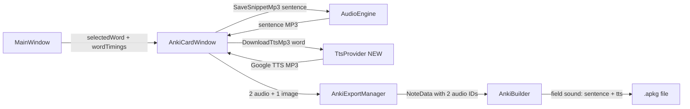

# Architecture Plan: TTS + Dual Audio in Anki Cards

## Overview

Two improvements to Anki card audio:
1. **Google TTS** — precise pronunciation from online service (fixes "in" clipping issue)
2. **Dual audio** — sentence from audiobook + TTS word in same card, two independent play buttons

## Current State

```mermaid
flowchart LR
    MW[MainWindow] -->|wordStart, wordEnd| ACW[AnkiCardWindow]
    ACW -->|SaveSnippetMp3| AE[AudioEngine]
    AE -->|MP3 bytes| ACW
    ACW -->|1 audio + 1 image| AEM[AnkiExportManager]
    AEM -->|1 NoteData| AB[AnkiBuilder]
    AB -->|field sound: [sound:m1.mp3]| APKG[.apkg file]
```

## Target State



## Component Changes

### 1. NEW FILE: [`RepeatSegment.App/TtsProvider.cs`](RepeatSegment.App/TtsProvider.cs)

```csharp
public class TtsProvider
{
    public async Task<byte[]?> DownloadTtsMp3(string text, string lang = "en")
}
```

- Calls `https://translate.google.com/translate_tts?ie=UTF-8&client=gtx&tl=en&q=WORD`
- 3 retries with 500ms delay
- Returns MP3 bytes (or null)
- 10s timeout
- Caches results on disk: `%APPDATA%/RepeatSegment/tts_cache/{md5(word)}.mp3`

### 2. [`RepeatSegment.App/AudioEngine.cs`](RepeatSegment.App/AudioEngine.cs) — Add method

```csharp
public string SaveSnippetMp3(double t1, double t2)  // EXISTS — reuse for sentence
```

No changes needed — `SaveSnippetMp3` already handles arbitrary time ranges. We'll call it with sentence bounds instead of word bounds.

### 3. [`RepeatSegment.App/AnkiCardWindow.xaml`](RepeatSegment.App/AnkiCardWindow.xaml) — UI changes

Add near existing audio controls:
```xml
<!-- Sentence audio (from book) -->
<Button Content="Preview sentence" Click="BtnPreviewSentence_Click"/>
<!-- TTS audio -->
<Button Content="Preview TTS" Click="BtnPreviewTts_Click"/>
<TextBlock x:Name="TxtTtsStatus"/>
```

### 4. [`RepeatSegment.App/AnkiCardWindow.xaml.cs`](RepeatSegment.App/AnkiCardWindow.xaml.cs) — Logic changes

**Constructor changes:**
- Accept `List<(double Start, double End)> _wordTimings` (whole text word bounds)
- Accept `TranscriptionProvider` (to access WordTimings)

**New fields:**
```csharp
private string? _savedSentenceMp3Path;
private byte[]? _ttsMp3Bytes;
private double _sentenceStart, _sentenceEnd;
```

**New method: `FindSentenceBounds(wordStart, wordEnd)`**
```
1. Get WordTimings from TranscriptionProvider
2. Find the word at wordStart (binary search — already GetWordIndexAt)
3. Walk LEFT from that word to find sentence start (. ! ? or index 0)
4. Walk RIGHT from that word to find sentence end (. ! ? or last index)
5. Return (words[left].Start, words[right].End)
```

**Modified: `BtnPlayAudio_Click` → `BtnPreviewSentence_Click`**
- Compute `_sentenceStart/_sentenceEnd` via `FindSentenceBounds`
- Call `_audio.SaveSnippetMp3(_sentenceStart, _sentenceEnd)`
- Play with `SoundPlayer`

**New: `BtnPreviewTts_Click`**
- Call `_ttsProvider.DownloadTtsMp3(_selectedWord)`
- Save to temp file, play with `SoundPlayer`
- Cache bytes in `_ttsMp3Bytes`

**Modified: `BtnCreate_Click`**
```csharp
// Before: one audio
mgr.AddMedia(mp3Path);

// After: two audios
string sentenceAudId = mgr.AddMedia(sentenceMp3Path);
string ttsAudId = mgr.AddMedia(ttsMp3Path);

// NOTE: mgr.AddNote only takes ONE audId parameter
// Need to extend to accept two
```

### 5. [`RepeatSegment.App/AnkiExportManager.cs`](RepeatSegment.App/AnkiExportManager.cs) — Extend

**Modified: `AddNote` signature:**
```csharp
// Before:
public void AddNote(string en, string transcription, string ru, string pictureId, string audioId, string context)

// After:
public void AddNote(string en, string transcription, string ru, string pictureId, string sentenceAudioId, string? ttsAudioId, string context)
```

**Fields in `NoteData`:**
```csharp
public class NoteData {
    public string En, Transcription, Ru, PictureMediaId, SentenceAudioMediaId, TtsAudioMediaId, Context;
}
```

### 6. [`RepeatSegment.App/AnkiBuilder.cs`](RepeatSegment.App/AnkiBuilder.cs) — Dual audio in sound field

**Current field assembly (line 82-84):**
```csharp
string snd = string.IsNullOrEmpty(n.AudioMediaId) ? "" : $"[sound:{n.AudioMediaId}]";
string flds = string.Join("\x1f", n.En, n.Transcription, n.Ru, img, snd, n.Context);
```

**New:**
```csharp
string sndParts = "";
if (!string.IsNullOrEmpty(n.SentenceAudioMediaId))
    sndParts += $"<div class=snd-label>📖 Sentence</div>[sound:{n.SentenceAudioMediaId}]";
if (!string.IsNullOrEmpty(n.TtsAudioMediaId))
    sndParts += $"<div class=snd-label>🔊 Word</div>[sound:{n.TtsAudioMediaId}]";
string snd = string.IsNullOrEmpty(sndParts) ? "" : sndParts;
```

**CSS addition (line 102):**
```css
.snd-label{font-size:11px;color:#888;margin:8px 0 2px}
```

### Cardinality — Anki plays each `[sound:]` independently

**Critical fact:** Anki renders each `[sound:file.mp3]` as a separate play button. No model changes needed — same `mid=1728000001L`, same fields, same templates. The `{{sound}}` field just outputs its content verbatim, and Anki's renderer parses `[sound:...]` tags.

### 7. [`RepeatSegment.App/MainWindow.xaml.cs`](RepeatSegment.App/MainWindow.xaml.cs) — Pass WordTimings

**Line 402 — where AnkiCardWindow is created:**
```csharp
// Before:
var window = new AnkiCardWindow(wordText, context, wStart, wEnd,
    _audio, _transcriptionProvider, _translationProvider, ru, wordText);

// After:
var window = new AnkiCardWindow(wordText, context, wStart, wEnd,
    _audio, _transcriptionProvider, _translationProvider, ru, wordText,
    _transcriptionProvider.WordTimings, new TtsProvider());
```

## Data Flow Summary

```
User selects text in MainWindow
  → wordStart, wordEnd, wordText
  → Open AnkiCardWindow

AnkiCardWindow:
  1. FindSentenceBounds(wordStart) → (_sentenceStart, _sentenceEnd)
  2. _audio.SaveSnippetMp3(_sentenceStart, _sentenceEnd) → sentence MP3
  3. _ttsProvider.DownloadTtsMp3(wordText) → TTS MP3 bytes
  4. User clicks "Create Card"
  5. AnkiExportManager.AddMedia(sentenceMp3) → sentenceAudioId
  6. AnkiExportManager.AddMedia(ttsMp3) → ttsAudioId
  7. AnkiExportManager.AddNote(..., sentenceAudioId, ttsAudioId, ...)
  8. AnkiBuilder formats sound field: "[sound:s.mp3] [sound:t.mp3]"
  9. .apkg with 2 audio buttons per card
```

## Files Touched (7 files)

| File | Change | Risk |
|------|--------|------|
| [`TtsProvider.cs`](RepeatSegment.App/TtsProvider.cs) | **NEW** — Google TTS download with caching | Low |
| [`AudioEngine.cs`](RepeatSegment.App/AudioEngine.cs) | None (SaveSnippetMp3 reused as-is) | None |
| [`AnkiCardWindow.xaml`](RepeatSegment.App/AnkiCardWindow.xaml) | 2 new buttons, 1 label | Low |
| [`AnkiCardWindow.xaml.cs`](RepeatSegment.App/AnkiCardWindow.xaml.cs) | Constructor + FindSentenceBounds + 2 audio paths | Medium |
| [`AnkiExportManager.cs`](RepeatSegment.App/AnkiExportManager.cs) | AddNote signature extended | Medium |
| [`AnkiBuilder.cs`](RepeatSegment.App/AnkiBuilder.cs) | NoteData + sound field + CSS | Medium |
| [`MainWindow.xaml.cs`](RepeatSegment.App/MainWindow.xaml.cs) | Pass WordTimings + TtsProvider | Low |

## Non-breaking changes

- Existing `.apkg` files remain fully compatible (`mid` unchanged)
- Old cards with single audio keep working
- New cards get dual audio
- Anki merge logic in `AnkiExportManager` handles both fields
